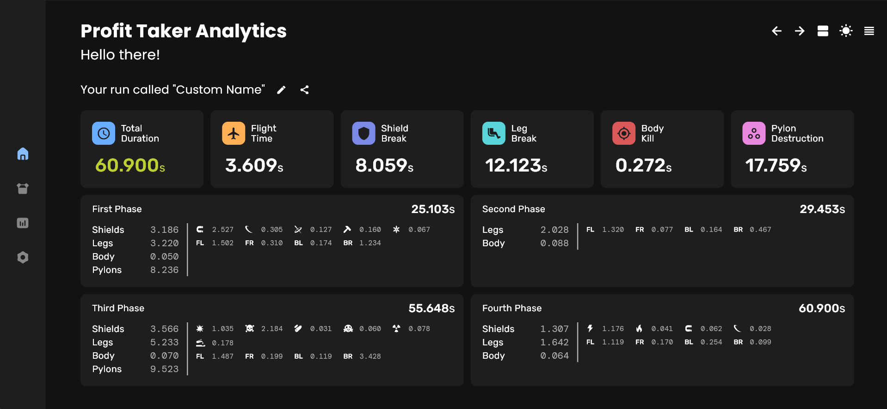
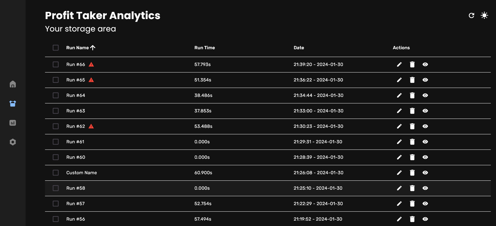

# Profit Taker Analytics App

The Profit Taker Analytics project is designed to enhance the experience for Profit Taker speedrunners in Warframe by providing an advanced analyzer with a user-friendly Graphical User Interface (GUI). This project introduces a powerful new parser powered by a Rust-based backend, seamlessly integrated with a sleek Flutter GUI, offering an intuitive and efficient way to visualize and interact with data.

The app provides users with an advanced, interactive tool to parse and analyze data, turning raw information into insightful visualizations that make it easier to track and optimize performance.

Download [here](https://basi.is-a.dev/pta/).

## Trusted by Elite Speedrunners

Our project proudly stands as the tool of choice for a majority of the top-tier speedrunners within the Warframe community. Renowned for their exceptional skills and dedication, these elite players have embraced our project to elevate their speedrunning experience. Join the best by incorporating our tool into your strategy, and experience firsthand why it's the preferred choice among Warframe's finest speedrunning experts.

## Screenshots

https://github.com/Basiiii/Profit-Taker-Analytics/assets/90209339/68ba883b-8360-4d5e-a094-2f63d58eaf59

## Features

- **Intuitive GUI Design:** Benefit from an intuitive and user-friendly Graphical User Interface (GUI), transforming raw data into a visually appealing format for easy interpretation.
- **Compiled Application:** No external dependencies are required, ensuring a hassle-free experience and seamless integration into your Warframe speedrunning toolkit.
- **Designed for Elite Speedrunners:** Embraced by some of the best speedrunners in the Warframe community, the Profit Taker Analytics app is designed to meet the high standards and demands of elite gaming strategies.
- **Parse Bugged Runs:** Unlike previous tools, this app can successfully parse bugged runs, ensuring you no longer lose valuable data.
- **Support for Windows & Linux:** The PTA app is available on both Windows and Linux operating systems, making sure even the Linux users can enjoy it!

## FAQ

#### Q1: Why develop the new Profit Taker Analytics app?

**A1:** The GUI enhances the gaming experience for Warframe speedrunners by providing a more intuitive and engaging platform to analyze mission data.

#### Q2: What benefits does the GUI bring to the Profit Taker Analytics app?

**A2:** The GUI transforms data presentation into a visually appealing interface, improving data accessibility and overall user experience. It also allows for easy future expansions and feature additions.

#### Q3: Is any special installation required?

**A3:** No, the Profit Taker Analytics app is a compiled application, ensuring a smooth setup with no need for external dependencies.

#### Q4: Can the app theme be customized?

**A4:** Customization options are being explored for future updates based on user feedback.

#### Q5: How can users provide feedback or report issues?

**A5:** Users can contribute feedback or report issues through this official GitHub repository, by emailing Basi at `hello.basi@proton.me`, or by sending a DM on Discord to `basi__`.

## Performance

In the realm of speedrunning, every second counts. That's why Profit Taker Analytics has been engineered to deliver an exceptionally fast and efficient performance. Speedrunners can seamlessly interact with the application without any compromise to their gameplay experience.

### Lightning-Fast Speed

Profit Taker Analytics operates at lightning speed, ensuring that you can access and analyze data swiftly. The app's responsiveness is optimized to deliver near-instant results, providing a seamless and efficient experience for speedrunners.

## Support

For support, email `hello.basi@proton.me` or message me on Discord: `basi__`.

## Contributing

Contributions are always welcome!

See [Contributing](CONTRIBUTING.md) for ways to get started.

Please adhere to this project's [Code of Conduct](CODE_OF_CONDUCT.md).

## Special Thanks

We would like to express our gratitude to the creators of [revoltage34/ptanalyzer](https://github.com/revoltage34/ptanalyzer), whose work inspired us. After exploring the original command-line tool, we recognized its potential and decided to create a new solution with a Rust-based backend parser and a Flutter-powered frontend. Profit Taker Analytics is a complete overhaul, offering a modern, user-friendly approach to analyzing and storing data through a sophisticated Graphical User Interface (GUI).

## Authors & Contributors

### Project Lead

- [Basi](https://github.com/Basiiii) - UI/UX Designer & Project Lead

### Developers

- [Basi](https://github.com/Basiiii) - Flutter App Developer
- [Kalaay](https://github.com/KalaayPT) - Rust Core Developer
- [scamcat](https://github.com/ScamCatt) - Rust Core Developer
- [RemasteredArch](https://remasteredarch.net/) - Rust Core Developer

### Notable Contributors

- Mebius - Contributed Chinese translations
- [Kalaay](https://github.com/KalaayPT) - Contributed Russian translations
- [Reava](https://github.com/Reava) - Contributed French translations
- [Neppkun](https://github.com/Neppkun) - Contributed Turkish translations
